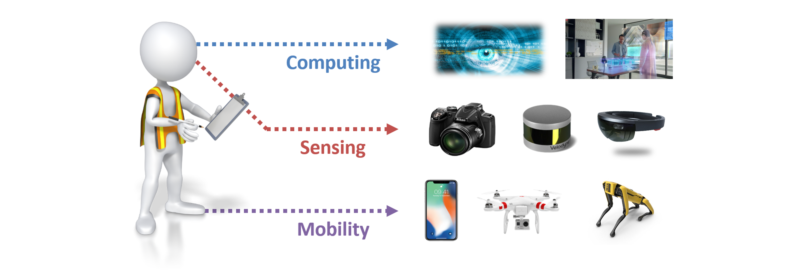

# CIVE497/700: Smart Structure Technology (Winter, 2020)

**Instructor:** Chul Min Yeum (E2-2313)  
**Class:** Monday and Wednesday, 11:30AM to 12:50PM at E2-3356     
**Email:** cmyeum@uwaterloo.ca  
**TA:** Juan Park (j246park@uwaterloo.ca)     
**Office Hours** Monday and Wednesday, 1:00PM to 2:00PM at E2-2313 (You can also email for an appointment)   

Last updated: 2020-02-04  

## Announcement  
:loudspeaker: **2020-02-04** [**Slides**](lecture/linear_filter) and [**tutorial**](tutorial/linear_filter) for Class 10 are posted: Linear filter        
:loudspeaker: **2020-02-02** [**Slides**](lecture/project_geometry) and [**tutorial**](tutorial/project_geometry) for Class 8 are posted: Projective geometry     
:loudspeaker::loudspeaker: **2020-02-02** [**Digital Image Processing**](tutorial/image_proc) is a prerequisite of this class but most students haven't been reviewed it yet. This tutorial requires understanding Class 10. Please study the tutorial before then. The due date for Task 3 is set to Feb 09 and the second due date is Feb 11.   
:loudspeaker::loudspeaker: **2020-02-02** The task assignment, [**Task3**](task/task3), is posted (due date: February 09, 2020).        

  
## Table of Contents
- [Course Description](#course-description)
- [Intended Learning Outcomes](#intended-learning-outcomes)
- [Prerequisite](#prerequisite)
- [Course Textbook](#course-textbook)
- [Course Outline](#course-outline)
- [Tasks](#tasks)
- [Communication](#communication)
- [Grading](#grading)
- [Note](#note)

## Course Description
This course offers an introduction to the emerging **smart structure technologies** in civil engineering. Smart structures integrate sensing, actuation, data processing and analysis, and control capabilities so that a structure can sense and respond to its changing external conditions in a rapid and automated manner. Among several topics in smart structure, this course focuses on [**structural assessment**](https://en.wikipedia.org/wiki/Structural_health_monitoring) using optical sensor data by implementing state-of-art image processing and computer vision techniques. As a special topic, basic concepts in machine learning, neural networks, convolutional neural networks (deep learning) are covered and relevant applications in civil engineering are introduced. An application-based learning approach is emphasized and tasks are designed in such a way that students implement smart structure technology to address contemporary problems in civil engineering. In addition, for graduate students, students should perform a research project, in which student will have an opportunity to design a technique with a potential application to smart structures. 

This course is specially designed to suit the interest of **graduate students** and **senior undergraduate students who may pursue graduate studies**. Based on the feedback received from the course in 2019 (six undergraduate and seven graduate students registered the course), you are expected to spend extra 12 hours or more week studying class materials as well as working on task assignments and research project. You will see the course outline and task assignments in the previous year from [**here**](w2019). 

## Intended Learning Outcomes
By the end of this course, students should be able to  
  
* Describe smart structure technology and its application in civil engineering
* Explain the working principle of an accelerometer and digital camera, and their data acquisition process
* Interpret the concept of image processing techniques through signal processing theory 
* Develop programs (MATLAB or Python) to process and analyze 2D and 3D optical data for structural assessment
* Demonstrate how to implement machine learning algorithms in solving real-world problems 
* Employ deep convolutional neural network for image classification
* Devise innovative smart structure technology for civil engineering applications and research 

## Prerequisite
This course requires basic knowledge in **linear algebra** and **probability** and skills at ***a sufficient level of a non-trivial computer programming*** (with **MATLAB** or  **Python**). Students also need to know how to use **Markdown**. If you are not familiar with or would revisit these topics, students must complete the following tutorials and questions inside:

**MATLAB tutorials**
* [**Matrices & Arrays**](tutorial/matlab): copy this folder in your computer and run `matrices_arrays.mlx` in MATLAB 
* [**Operations and Elementary Operations**](tutorial/matlab): copy this folder in your computer and run `operators_elem_operations.mlx` in MATLAB

**Topics**
* [**Digital Image Processing**](tutorial/image_proc): copy this folder in your computer and run `digital_image_processing.mlx` in MATLAB (Note: If you do not find the sample images, you can download them from [**here**](https://www.dropbox.com/s/xgznul2u1l16iaw/sample_images.zip?dl=0))   
* [**Markdown**](tutorial/markdown)

## Course Textbook 
This course is not based on any particular textbook. The instructor will provide relevant keywords (search by yourself), reading materials, and website links in each class. 

## Course Outline
Slides and tutorials are will be updated soon.   

|Class|Topics|Slides|Tutorial|
|:----|:-----|:----|:-----|
|Class 01|**Introduction**|[**link**](lecture/introduction)|&nbsp;|
|Class 02|**MATLAB Tutorial**|[**link**](lecture/matlab)|&nbsp;|
|Class 03|**Data Acquisition**|[**link**](lecture/data_aquisition)|[**link**](tutorial/data_aquisition)|
|Class 04|**Signal Processing I**|[**link**](lecture/signal_processing)|[**link**](tutorial/signal_processing)|
|Class 05|**Signal Processing II**|[**link**](lecture/signal_processing)|[**link**](tutorial/signal_processing)| 
|Class 06|**Signal Processing III**|[**link**](lecture/signal_processing)|[**link**](tutorial/signal_processing)| 
|Class 07|**Digital Image**|[**link**](lecture/digital_image)|&nbsp;|
|Class 08|**Projective Geometry**|[**link**](lecture/project_geometry)|[**link**](tutorial/project_geometry)|
|Class 09|**Review**|&nbsp;|&nbsp;| 
|Class 10|**Linear Filtering**|[**link**](lecture/linear_filter)|[**link**](tutorial/linear_filter)|   
|Class 11|**Edge Detection**|&nbsp;|&nbsp;|
|Class 12|**Feature 1**|&nbsp;|&nbsp;|  
|Class 13|**Feature 2**|&nbsp;|&nbsp;|
|Class 14|**RANSAC**|&nbsp;|&nbsp;|
|Class 15|**Camera Model**|&nbsp;|&nbsp;|
|Class 16|**Multiview Geometry**|&nbsp;|&nbsp;|
|Class 17|**Structure-from-motion (SfM)**|&nbsp;|&nbsp;|
|Class 18|**Review**|&nbsp;|&nbsp;|
|Class 19|**Microsoft Azure Tutorial**|&nbsp;|&nbsp;|
|Class 20|**Machine Learning I**|&nbsp;|&nbsp;|
|Class 21|**Machine Learning II**|&nbsp;|&nbsp;|
|Class 22|**Neural Network**|&nbsp;|&nbsp;|
|Class 23|**Convolutional Neural Network**|&nbsp;|&nbsp;|
|Class 24|**Presentation**|&nbsp;|&nbsp;|

## Tasks
There will be **10 tasks** and posted on either weekly or biweekly on this course website. **The instructor encourage students to work in groups through collaborative learning, but to submit their assignments individually.** The task will have programming components or photography components, where students will use their own camera to capture and process their own images and discuss the results. Students are supposed to complete all tasks and turn their works in by the due date. After the due data, there is 25% deduction in the final mark and students must submit their works within a week after the due data. After then, the submission of the works will not be accepted unless accompanied by a valid excuse and some additional points might be deducted depending upon the circumstances.  

**If you are a Python user, you can use a Jupyter notebook instead of a Markdown. When you submit your homework, you should submit both .IPyhone and .pdf.**

[**Submission instruction of your work**](#submission-instruction-of-your-work)

|Task|Topics|Announcement|Due Date|
|:----|:-----|:----|:-----|
|Task1|[**Programming Practice**](task/task1) &nbsp;&nbsp;&nbsp;&nbsp;&nbsp;&nbsp;   |January 06, 2020|January 17, 2020|
|Task2|[**Signal Processing I**](task/task2) &nbsp;&nbsp;&nbsp;&nbsp;&nbsp;&nbsp;   |January 16, 2020|January 29, 2020|   
|Task3|[**Signal Processing II**](task/task3) &nbsp;&nbsp;&nbsp;&nbsp;&nbsp;&nbsp;  |January 27, 2020|February 09, 2020|   
|Task4|**Camera Sensor and Digital Image** &nbsp;&nbsp;&nbsp;&nbsp;&nbsp;&nbsp;   |||
|Task5|**Homography** &nbsp;&nbsp;&nbsp;&nbsp;&nbsp;&nbsp;   |||      

## Communication  
**All communication will be made through [this course website](https://github.com/chulminy/CIVE497-CIVE700)**, especially for this web page. The instructor will make a note in the ["Announcement"](#announcement) section after updating the web page. Students can configure email notification for by ["watching"](https://help.github.com/articles/watching-and-unwatching-repositories/) this course website or use a version control system for tracking its changes. Thus, **students are responsible for checking the website regularly** for any relevant course information or announcements. 

In this course, both the instructor and the students are encouraged to engage in online discussions to create and facilitate a collaborative learning experience. Students are invited to ask questions and answer them, and share their knowledge and resources. **Please direct your communication to an** [***Issues***](https://github.com/chulminy/CIVE497-CIVE700/issues) **board (tab) on this website.** However, if there is a good reason not to use the discussion forum (e.g. personal matters, a question that might reveal your solution of your report, etc.), please directly contact the instructor via email (cmyeum@uwaterloo.ca) or use the office hours. 

[**Discussion forum instruction**](#discussion-forum-instruction)

## Grading  
The final grade will be based on the total marks earned during the semester. Each task will be graded on the basis of 100 points and will contribute the final grade with **different weights**. The evaluation guideline for the project can be seen [**here**](#guideline-for-the-project). Note that undergraduate and graduate students are marked using different evaluation metrics.

**Undergraduate student**: Tasks (100%)   
**Graduate student**: Tasks (70%) and Project (30%)  

## Project 
Graduate students are encouraged to bring their own problems related to their thesis, research projects or potential research in civil engineering that they plan to pursue near future. This course gives special attention to exploring theory and potential techniques in the field of smart structure to address real problems that students are exposed to or involved in. Thus, students need to devise feasible project topics that are achievable within your current or future graduate study. 

[**Guideline for the project**](#guideline-for-the-project)

## Note

### Academic integrity
In order to maintain a culture of academic integrity, members of the University of Waterloo community are expected to promote honesty, trust, fairness, respect and responsibility. [Check <a href="https://uwaterloo.ca/academic-integrity/">the Office of Academic Integrity</a> for more information.]

### Grievance 
A student who believes that a decision affecting some aspect of his/her university life has been unfair or unreasonable may have grounds for initiating a grievance. Read <a href="/secretariat-general-counsel/node/100">Policy 70, Student Petitions and Grievances, Section 4</a>. When in doubt, please be certain to contact the department’s administrative assistant who will provide further assistance.

### Discipline
A student is expected to know what constitutes academic integrity to avoid committing an academic offence, and to take responsibility for his/her actions. [Check <a href="https://uwaterloo.ca/academic-integrity/">the Office of Academic Integrity</a> for more information.] A student who is unsure whether an action constitutes an offence, or who needs help in learning how to avoid offences (e.g., plagiarism, cheating) or about “rules” for group work/collaboration should seek guidance from the course instructor, academic advisor, or the undergraduate associate dean. For information on categories of offences and types of penalties, students should refer to <a href="/secretariat-general-counsel/node/97">Policy 71, Student Discipline</a>. For typical penalties, check <a href="/secretariat-general-counsel/node/131">Guidelines for the Assessment of Penalties</a>.

### Appeals
A decision made or penalty imposed under <a href="/secretariat-general-counsel/node/100">Policy 70, Student Petitions and Grievances</a> (other than a petition) or <a href="/secretariat-general-counsel/node/97">Policy 71, Student Discipline</a> may be appealed if there is a ground. A student who believes he/she has a ground for an appeal should refer to <a href="/secretariat-general-counsel/node/99">Policy 72, Student Appeals</a>.

### Note for students with disabilities 
<a href="https://uwaterloo.ca/disability-services/">AccessAbility Services</a>, located in Needles Hall, Room 1401, collaborates with all academic departments to arrange appropriate accommodations for students with disabilities without compromising the academic integrity of the curriculum. If you require academic accommodations to lessen the impact of your disability, please register with AccessAbility Services at the beginning of each academic term.

### Turnitin.com
Text matching software (Turnitin®) may be used to screen assignments in this course. Turnitin® is used to verify that all materials and sources in assignments are documented. Students' submissions are stored on a U.S. server, therefore students must be given an alternative (e.g., scaffolded assignment or annotated bibliography), if they are concerned about their privacy and/or security. Students will be given due notice, in the first week of the term and/or at the time assignment details are provided, about arrangements and alternatives for the use of Turnitin in this course.

It is the responsibility of the student to notify the instructor if they, in the first week of term or at the time assignment details are provided, wish to submit alternate assignment.

## Supplement

### Discussion forum instruction
- Students are allowed to use either their own GitHub account or new account for this class if you want anonymity. They do not have to make a new account using their university email accounts. 
- Please be respectful of your peers, instructor, and others in your posts and comments.
- Asking good questions is another way of learning by summarizing and explaining what you know and do not know. Thoughtful questions and answers will help all students in this class. Before posting a question, please ask yourself whether you are truly stuck (meaning that the answers can be readily found on the web) and your question are complete and legible. 
- In addition, please check if the same question was asked before.   
- When students write a post on the *Issues* board, the instructor or TA will assign an appropriate label among "Task", "Class", "Project", "Resource", and "Suggestion".  
- Inappropriate posts and comments are immediately deleted and closed without a notice. 

### Submission instruction of your work
Students must **electronically** turn in both their source code (with data) and report. The report must be written with **Markdown script (GFM)** first and is converted to a PDF format. All other formats like docx, or pptx, or in hardcopy **are not permitted**. A submission guideline will be varied depending on the tasks and provided with each task. 

Students choose either a **MATLAB** or **Python** to complete the tasks. The source code needs to be neatly organized and include detailed comments. The instructor may run your codes in the instructor's Window computer where MATLAB 2018b and Python above 3.4 are installed. It is recommended to use MATLAB for your work because the instructor does not need to install additional code libraries. However, students can use Python at their own risk that it might not run on the instructor's computer. Pillow and OpenCV for computer vision programming and some basic python packages (e.g. Pandas, NumPy, matplotlib, sklearn, etc) will be installed on the computer. It is recommended that any external code library should not be used unless explicitly mentioned in tasks. **The instructor is not able to install every different libraries on the computer.** If there is a convincing reason for the use of specific libraries, please contact the instructor or TA in advance and exceptions will be made on a case-by-case basis. Note that OS(platform)-dependent functions, scripts or libraries are not permitted. The students must check their report in a Windows computer before its submission.   

Marked reports will be distributed via email and sample solutions for tasks may be reviewed in class with the instructor. A couple of the best reports in each task will be posted on the class web page with the consent of the corresponding students. 

### Guideline for the project
Individuals/teams should clearly identify the challenges of existing applications, procedures, and research in civil engineering and then consider how smart structure technology contributes to addressing them. The project does not have to be big, fancy and innovative if your project outcomes can marginally improve existing problems or advance practices. For example, it could be proposing a modification to existing processes, applying image processing and computer vision technology to streamline analysis and documentation processes, applying a new signal or image processing techniques to improve the accuracy of your technique. The possibilities are very open and diverse if they are attainable. However, for instance, the following two examples are not acceptable because they are not attainable: *"we will build a robot to automatically and rapidly construct a building"* or *"we will develop a new vision sensor that can measure 3D volume"*. 

The project can be done either individually or in teams of two or three students. If students choose to work in a team, they need to justify the need for a teamwork and define the scope of works in individual members. For the completion of the project, each group must reach the following **milestones**:  

- **Individual/team meeting (3 or 4th week)**: Individuals or teams need to schedule a separate meeting with the instructor so that the project ideas are refined together. The instructor encourages the individual/team preparing and bringing relevant slides or reading materials to the meeting. In the case of the team project, all members must agree on the direction and scope of their project before having a meeting with the instructor. They also can take advantage of office hours or separate meetings if further discussion is needed.  

- **Abstract submission (7 or 8th week)**: Individuals or teams will submit a 1-page abstract that can summarize your project. The abstract should include (1) project title, (2) motivation, problem or challenge, (3)objective, (4) implemented/developed method(s), and (5) validation/demonstration plan(s). In addition, one representative figure (graphical abstract) must be included. It should have a self-explanatory image to illustrate motivation and expected outcome, summarize a procedure of the methods implemented/developed, or describe updated processes or outcomes that benefit from your technique or algorithm designed in the project. The abstract should not exceed 600 words. **The evaluation of the abstract contributes 30% of the project grade.** 

- **10-minute final presentation (at Class 24)**: A 10-minute presentation will be given at the final class. Individuals/teams should strive to give a comprehensive and understandable presentation that the other students recognize the value of your project. Similar to the 3-minute presentation, time limits will be strictly enforced. **The evaluation of the final presentation contributes 50% of the project grade** and the detailed evaluation criteria will be announced after the abstract submission. 
