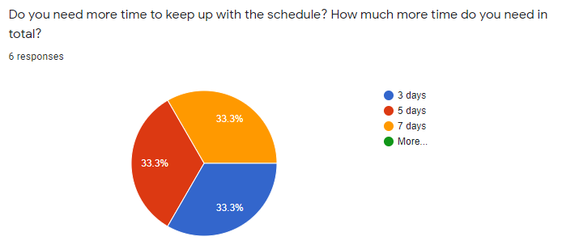

# CIVE 497/700: Study Progress Survey

## General
Eight students responded to the survey and five students left feedback. 

||
|:--:|
||

I would only delay the task assignment schedules for **3~5 days**, not  delay the lecture schedule because I would not reduce the topics planned in this course. Rather, I will make a short assignment for Task 09 based on a series of lectures regarding machine learning (Class 17~20). This gives you time to catch up with lectures and assignments during the final exam period. I just re-scheduled all due dates for the rest of the assignments by reflecting student's feedback. Now, all due dates will be on Friday so you can ask questions about lectures or assignments during the office hours.      
 
## Students' Feedback 
**Here is my response to each written feedback**  
*Again, if you feel hard and need help, just send me a message through MS team. Any questions will be fine.*

|Feedback & Answer|
|:---|
|**Student 1:** I am really enjoying the course!|
|**CM:** Thank you. I appreciate!|
|**Student 2:** Overall I really like the ability to late-submit up to 3 assignments. It gives much needed flexibility in a very hectic time. Although when late-submitting an assignment it might mean that a student will fall behind on future assignments, so for this reason I think a brief 'pause' in lectures as you have suggested, of a few days, is helpful for students to catch up. Other than that, everything's pretty good.|
|**CM:** Yes. Please check out the new assignment due date. All due dates are  delayed for 3~5 days.|
|**Student 3:** The lectures are very well designed. I find the course assignments very time taking and a week seems too short to do them. I think the number of similar questions can be reduced for each task.|
|**CM:** I will consider reducing the number of problems in Tasks 06 and 07.|
|**Student 4:** Is it possible to push back the due date for Task 6 since it is due 5 days after the due date for Task 5? Thank you.|
|**CM:** Yes. All due dates are  delayed for 3~5 days.|
|**Student 5:** Since assignments are typically due around Wednesday I haven't had a chance to look at the next lecture prior to the office hours also held on Wednesday so I don't attend. If office hours could be moved a few days after the previous assignment due date so I can get a chance to review the next lecture and maybe start the assignment it would be very helpful. Maybe Friday or Monday assuming past assignment was due on Wednesday. Also, I understand that more time would be very helpful for some students but I am very interested in the final topics (neural networks) and would very much appreciate it if the time delays don't affect us being able to learn the final topics. Recent lectures have been a lot more helpful! I think it would be a good idea if the purpose of what we are learning and why it's important/how we are going to use it is stated at the beginning of the lecture. I think it would give a better idea of understanding the topic since right now we go into each lecture a little blind. Now that we understand more on the course format (mark down editors, where to find assignments, etc) it's getting easier to work on the course but all the different sites, technologies, naming conventions and file formats made it very difficult at the beginning. Maybe a lecture on all this in the beginning would be helpful for next year's students. Overall, course is going much better now than before!|
|**CM:** Thank you for very good feedback. Yes, I'm improving the lecture every year so I will add more context for each topic. As you suggested, I would only delay the task assignment schedules for **3~5 days**, not  delay the lecture schedule because I would not reduce the topics planned in this course. Also, all due dates will be on Friday so you can ask questions about lectures or assignments during the office hours.|