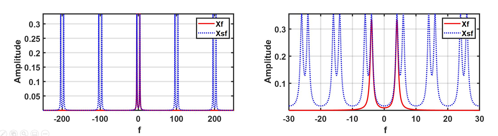

# Task03: Signal Processing II

**Announcement**: January 27, 2021        
**1st due date**: February 15, 2021 before 11:59pm
**2nd due date**: February 22, 2021 before 11:59pm 

The main goal of this task is to understand the fundamental of signal processing, especially for discrete Fourier transformation. You must study the tutorial to solve the corresponding problems. Please answer all sub-questions in each problem. You should write your own code to solve these questions. 

## Problem 1: Convolution (10 points)

&nbsp;&nbsp;&nbsp;&nbsp;&nbsp;&nbsp;&nbsp;&nbsp;

<!-- f(t) = \begin{Bmatrix}
A, \,\,\,\,\,\,\,\,\,\,\,\,\,\,   a > \left | t \right |\\ 
0, \,\,\, \,otherwise
\end{Bmatrix} -->

<!-- f(t) = \begin{Bmatrix}
B, \,\,\,\,\,\,\,\,\,\,\,\,\,\,   b > \left | t \right |\\ 
0, \,\,\, \,otherwise
\end{Bmatrix} -->

where A = 3, a= 3, and B = 2, b = 3

**(a)** Compute an analytic y(t) which is the convolution of f(t) and g(t):

**(b)** Write a code to numerically compute y(t) and plot y(t). Please use for-loop and do not use `conv`. 

**(c)** Write a code to numerically compute y(t) and plot y(t). Please use `conv`. 

## Problem 2: Convolution Theorem (10 points)
**(a)** Proof the convolution theorem and explain the meaning of these relationships in your words. 

<!-- \begin{matrix}
F\left \{ x(t) \ast h(t) \right \} = X(f) \cdot  H(f) \\ 
F\left \{ x(t) \cdot h(t) \right \} = X(f) \ast  H(f)
\end{matrix}
-->

<!-- -->

**(b)** Compute a Fourier transform of the triangular function in both analytic and numeric ways (Note that this function is not periodic):

**(c)** Please explain the result in (b) using your answers for Problem 1.  

## Problem 3: Discrete Fourier Transform 1 (20 points)
**(a)** Please explain the difference between the following three notations in the lecture slide: 

 

**(b)** What do these two graphs explain in the lecture slides? 

**(c)** What is the meaning of the following relationship in the lecture slide? Please explain it. 

**(d)** What is the meaning of the following relationship in the lecture slide? What issues are introduced by Fourier transform a discrete sequence? Please answer this question using this graph.  

## Problem 4: Discrete Fourier Transform 2 (20 points) - Use FFT
 &nbsp;&nbsp;&nbsp;&nbsp; where a = 2, b = 2, c= 6, f1 = 3, and f2 = 6 

 &nbsp;&nbsp;&nbsp;&nbsp; where a = 0.3, b = 10, c= 3, f1 = 5, and f2 = 8 

**(a)** z1 and z2 are discrete signals, which are obtained by digitizing (sampling) y1(t) and y2(t) with a sampling rate of 50 Hz and collecting them for 5 seconds, respectively. Please plot z1 and z2 in the time domain (include a proper time axis).  

**(b)** Perform the discrete Fourier transform of z1 and z2, and plot your graphs in the frequency domain (include a proper frequency axis). Plot only positive frequency signals with absolute values.

**(c)** Please compare the shape of the frequency curves of z1 and z2. Which frequency curve is thinner (more narrow)? For example, compare the frequency curve at f1 in both graphs. Which one is thinner? Please explain your answer. What makes the difference? 

## Problem 5: Discrete Fourier Transform 3 (30 points) - Use FFT

where A1 = 2, A2 = 5, and A3 = 10. 

**(a)** y1 is a discrete signal, which is obtained by digitizing y(t) with a sampling rate of 200 Hz for 3 seconds. Please plot y1 in the time domain (include a proper time axis). Please connect the sampled points.  

**(b)** Perform the discrete Fourier transform of y1 and plot your graph in the frequency domain (include a proper frequency axis). Plot only a positive frequency signal. Can we measure all three frequencies? 

**(c)** y2 is a discrete signal, which is obtained by digitizing y(t) with a sampling rate of 110 Hz for 3 seconds. Please plot y2 in the time domain (include a proper time axis). Please connect the sampled points.

**(d)** Perform the discrete Fourier transform of y2 and plot your graph in the frequency domain (include a proper frequency axis). Plot only a positive frequency signal. Can we measure all three frequencies? 

**(e)** If you digitize a longer-duration signal (let's say 100 seconds) with a sampling rate of 110 Hz, can you measure and extract all three frequencies contained in the original signal, y(t)? Please explain your answer. 

**(f)** If you digitize the signal with a sampling rate of 120 Hz for 20 seconds, can you measure and extract all frequencies contained in the original signal, y(t)? please explain your answer.

**(g)** If you digitize the signal with a sampling rate of 151 Hz for 20 seconds, can you measure and extract all frequencies contained in the original signal, y(t)? please explain your answer.

## Problem 6: Frequency Analysis (10 points)
Two sinusoidal accelerations are measured using an accelerometer in a smartphone. Each of the waves is stored at `data1.mat` and `data2.mat`. 

**(a)** Load `data1.mat` and plot the acceleration signal in a z direction (`zvib`). What is the main frequency of this wave? The sampling frequency is 10.1355 Hz. 

**(b)** Load `data2.mat` and plot the acceleration signal in a z direction (`zvib`). What is the main frequency of this wave? The sampling frequency is 10.1192 Hz. 

**Submission of Your Work**
* You should turn in a report to uw.task@gmail.com. When you send your email, please cc your email for future reference.  
* A subject of your email must be the format of "Task03_`Your name` _ `Degree` _ `ID`"
	* `Your name`: first five lower-case letter your **first + last** name. It should be lower case. (i.g Chul Min Yeum -> chulmi, Juan Park -> juanp)   
	* `Degree`: pick your degree among BA, ME, MA, and PH (BA=Undergraduate, ME=MEng, MA=MASc, and PH=PhD)  
	* `ID`: your school ID
	* Please do not include any other text except this subject line.    
* Your report includes styled codes for all three problems (please check the Markdown tutorial for code styling). 
* The report must be written with Markdown script (GFM) and all other formats like .docx or .pptx are not permitted. 
* You should also include a report in pdf that is converted from your report in Markdown.  
* In your submission folder, you should include a report in the format of both .pdf and .md in a folder. And, it should be zipped before attaching it to your email. 
* The formats of the folder and files are 
	* Folder name: Task03_`Your name` _ `Degree` _ `ID` (same with the subject of your email)  
	* File names: "Rept_`Your name` _ `Degree` _ `ID`.md and .pdf".   
* Please review the general submission instruction in the course syllabus. 
* When you violate these submission guidelines, your report may be returned. 

## Note
* Please post a question if you need to help understand the problem and/or tutorials. 
* You are permitted to discuss the task with your colleagues, but do not copy the solutions.     
* Your grade depends on the completeness and clarity of your work.  
* You should include clear and concise comments in your codes.  