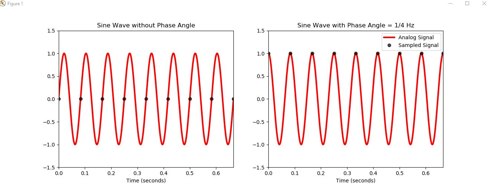

# Problem 1

(d) Plotting 6 Hz analog signal with 12Hz sampling frequency **(incorrect)**

(d) Plotting 12 Hz analog signal with 12Hz sampling frequency 

# Problem 2

# Problem 3 (Neil, Juan, Laurent)

**(a)** Please explain a quantization error. When do they occur? How to avoid? (Laurent)
Quantization error is an error stemming from the conversion of a continuous signal to a discrete signal. There is only a finite range of values which can be represented in a discrete signal, and so information is lost about what happens "between" the discrete points taken from the analog signal. This occurs in all digital sampling cases - one would need infinite memory to fully suppress this error. In practice, the error can be effectively minimized by choosing a high enough resolution for the discrete signal to ensure that any data of interest is not missed between captured points.

No :loudspeaker: :loudspeaker: **Sampling rate**, **high resolution sensor**, **Oversampling**

**(b)** Please explain a clipping error. When do they occur? How to avoid? (Laurent)
Clipping occurs when the amplitude of a signal is higher than what the sensor can handle. For instance, in a photo, clipping occurs when too much light hits the sensor (overexposure) and everything simply appears white, with loss of information. This can be avoided by choosing a sensor appropriate for the data being captured, with a working range large enough for the analog signal.

No :loudspeaker: :loudspeaker: **Sensor**

**(c)** Please explain an oversampling issue. When do they occur? What are the consequence of the oversampling? (Neil)
* Oversampling means to sample with a sampling frequency that is (significantly) higher than the required nyquist_frequency+eps. 
* The amount of data is increased --> Vectorlength increased.
* **The SNR is increased (see https://en.wikipedia.org/wiki/Oversampling)**

# Problem 4 (Laurent)

# Problem 5 (Juan, Laurent)    

# Problem 6 (Steven)

## (a) cosine wave (Steven)
$$
x(t)=\cos(2\pi p_0t)
$$

$$
X(f)=\int_{-\infty}^{\infty}e^{-i2\pi ft}\cos(2\pi p_0t)\mathrm{d}t
=\int_{-\infty}^{\infty}e^{-i2\pi ft}\frac{e^{i2\pi p_0t}+e^{-i2\pi p_0t}}{2}\mathrm{d}t
=\frac12\int_{-\infty}^{\infty}[{e^{-i2\pi (f-p_0)t}+e^{-i2\pi (f+p_0t)}}]\mathrm{d}t
$$

$$
\cdot \cdot \cdot X(f)=\frac12[\delta(f-p_0)+\delta(f+p_0)]
$$

### (b) cosine wave + dc (direct current) wave
$$
x(t)=\cos(2\pi p_0t)+d
$$

$$
X(f)=\int_{-\infty}^{\infty}e^{-i2\pi ft}[\cos(2\pi p_0t)+d]\mathrm{d}t
=\int_{-\infty}^{\infty}e^{-i2\pi ft}[\frac{e^{i2\pi p_0t}+e^{-i2\pi p_0t}}{2}+d]\mathrm{d}t
$$

$$
\cdot \cdot \cdot X(f)=\frac12\int_{-\infty}^{\infty}[{e^{-i2\pi (f-p_0)t}+e^{-i2\pi (f+p_0t)}}]\mathrm{d}t + \int_{-\infty}^{\infty}de^{-i2\pi ft}\mathrm{d}t
=\frac12[\delta(f-p_0)+\delta(f+p_0)]+d\delta(f)
$$

### (c) Gaussian function (Steven)
$$
y=\frac{1}{\sigma \sqrt{2\pi}}e^{-(x)^2/2\sigma^2}
$$

$$
X(f)=\int_{-\infty}^{\infty}e^{-i2\pi ft}[\frac{1}{\sigma \sqrt{2\pi}}e^{-(x)^2/2\sigma^2}]\mathrm{d}t
=\frac{1}{\sigma \sqrt{2\pi}}\int_{-\infty}^{\infty}e^{-i2\pi ft}[e^{-(x)^2/2\sigma^2}]\mathrm{d}t
$$

$$
\cdot \cdot \cdot X(f)
=\frac{1}{\sigma \sqrt{2\pi}}\int_{-\infty}^{\infty}e^{-\frac{1}{2\sigma^2}[x^2-i4\pi \sigma^2fx]}\mathrm{d}t
=\frac{1}{\sigma \sqrt{2\pi}}\int_{-\infty}^{\infty}e^{-\frac{1}{2\sigma^2}[x^2-2(i2\pi \sigma^2f)t+(i2\pi \sigma^2f)^2-(i2\pi \sigma^2f)^2]}\mathrm{d}t
$$

$$
\cdot \cdot \cdot X(f)
=\frac{1}{\sigma \sqrt{2\pi}}[\int_{-\infty}^{\infty}e^{-\frac{1}{2\sigma^2}(t-i2\pi \sigma^2f)^2}\mathrm{d}t] \cdot e^{\frac{1}{2\sigma^2}(i2\pi \sigma^2f)^2}
=\frac{1}{\sigma \sqrt{2\pi}}[\sigma \sqrt{2\pi}] \cdot e^{-(\sqrt{2}\pi \sigma f)^2}
=e^{-2\pi^2\sigma^2f^2}
$$

## Problem 7: Fourier Transformation 2

### (a) Compute the Fourier transformation (integral) of the following function (Steven)
$$
y=e^{-a|t|}(b\cdot \cos(2\pi f_1t)+c\cdot \cos(2\pi f_2t)
$$

$$
T(f)=\int_{-\infty}^{\infty}e^{-i2\pi ft}[e^{-a|t|}(b\cdot \cos(2\pi f_1t)+c\cdot \cos(2\pi f_2t)]\mathrm{d}t
$$

$$
\cdot \cdot \cdot T(f)
=\int_{-\infty}^{\infty}e^{-i2\pi ft}[e^{-a|t|}(b\cdot \cos(2\pi f_1t)]\mathrm{d}t + \int_{-\infty}^{\infty}e^{-i2\pi ft}[e^{-a|t|}c\cdot \cos(2\pi f_2t)]\mathrm{d}t
$$

$$
\cdot \cdot \cdot T(f)
=b\int_{-\infty}^{\infty}e^{-a|t|}\frac12(e^{i2\pi f_1t}+e^{-i2\pi f_1t})e^{-i2\pi ft}\mathrm{d}t + c\int_{-\infty}^{\infty}e^{-a|t|}\frac12(e^{i2\pi f_2t}+e^{-i2\pi f_2t})e^{-i2\pi ft}\mathrm{d}t
$$

$$
\cdot \cdot \cdot T(f)
=\frac{b}{2}\int_{-\infty}^{\infty}e^{-a|t|}(e^{-i2\pi (f-f_1)t}+e^{-i2\pi (f-f_1)t})\mathrm{d}t + \frac{c}{2}\int_{-\infty}^{\infty}e^{-a|t|}(e^{-i2\pi (f-f_2)t}+e^{-i2\pi (f-f_2)t})\mathrm{d}t
$$

$$
\cdot \cdot \cdot T(f)
=\frac{b}{2}\int_{-\infty}^{\infty}e^{-a|t|}(e^{-i2\pi (f-f_1)t}+e^{-i2\pi (f-f_1)t})\mathrm{d}t + \frac{c}{2}\int_{-\infty}^{\infty}e^{-a|t|}(e^{-i2\pi (f-f_2)t}+e^{-i2\pi (f-f_2)t})\mathrm{d}t
$$

$$
\cdot \cdot \cdot T(f)
=\frac{ab}{a^2+[2\pi(f-f_1)]^2}+\frac{ab}{a^2+[2\pi(f+f_1)]^2}+\frac{ac}{a^2+[2\pi(f-f_2)]^2}+\frac{ac}{a^2+[2\pi(f+f_2)]^2}
$$