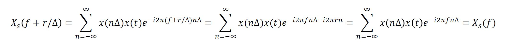

# Task1-2: Signal Processing II

**Announcement**: February 06, 2019  
**1st due date**: February 18, 2019 (Monday) before 11:59 pm  
**2nd due date**: February 23, 2019 (Saturday) before 11:59 pm  

The main goal of this task is to understand the fundamental of data acquisition system and signal processing. You must study the following two tutorials (`signal_processing_V4.mlx`, `data_aquisition_V3.mlx`) to solve the corresponding problems. Please answer all sub-questions in each problem. You should write your own code to solve these questions. 

## Problem 1: Convolution (10 points)

**(a)** Compute an analytic y(t) which is the convolution of f(t) and g(t):

**(b)** Write a code to numerically compute y(t) and plot y(t). Please use for-loop and do not use `conv`. You can randomly assign the values of A and a.   

**(c)** Write a code to numerically compute y(t) and plot y(t). Please use `conv`. You can randomly assign the values of A and a. 

## Problem 2: Convolution Theorem (10 points)
**(a)** Proof the convolution theorem and explain the meaning of these relationships in your words. 

**(b)** Compute a Fourier transform of the triangular function in both analytic and numeric ways (Note that this function is not a periodic):

**(c)** Please explain the result in (b) using your answers for Problem 1.  

## Problem 3: Discrete Fourier Transform 1 (10 points)
**(a)** What is the meaning of the following relationship in the lecture slide? Please explain it. 

**(b)** What is the meaning of the following relationship in the lecture slide? Please explain it.  

**(c)** What is the difference between these two functions in the lecture slide? :

&nbsp; and &nbsp; ,    

## Problem 4: Discrete Fourier Transform 3 (20 points) - Use FFT
 &nbsp;&nbsp;&nbsp;&nbsp; where a = 2, b = 2, c= 6, f1 = 3, and f2 = 6 

 &nbsp;&nbsp;&nbsp;&nbsp; where a = 0.3, b = 10, c= 3, f1 = 5, and f2 = 8 

**(a)** z1 and z2 are discrete signals, which are obtained by digitizing y1(t) and y2(t) with a sampling rate of 50 Hz and collecting them for 5 seconds, respectively. Please plot z1 and z2 in the time domain (include a proper time axis).  

**(b)** Perform the discrete Fourier transform of z1 and z2, and plot your graphs in the frequency domain (include a proper frequency axis). Plot only positive frequency signals.

**(c)** Please compare the shape of the frequency curves of z1 and z2. Which frequency curve is thinner (more narrow)? For example, compare the frequency curve at 3 Hz in (b) and 5 Hz in (d). Which one is thinner? Please explain your answer. What makes the difference? 

## Problem 5: Discrete Fourier Transform 2 (30 points) - Use FFT

where A1 = 3, A2 = 10, and A3 = 5. 

**(a)** y1 is a discrete signal, which is obtained by digitizing y(t) with a sampling rate of 500 Hz for 3 seconds. Please plot y1 in the time domain (include a proper time axis). 

**(b)** Perform the discrete Fourier transform of y1 and plot your graph in the frequency domain (include a proper frequency axis). Plot only a positive frequency signal.

**(c)** y2 is a discrete signal, which is obtained by digitizing y(t) with a sampling rate of 100 Hz for 3 seconds. Please plot y2 in the time domain (include a proper time axis). 

**(d)** Perform the discrete Fourier transform of y2 and plot your graph in the frequency domain (include a proper frequency axis). Plot only a positive frequency signal.

**(e)** If you digitize a longer-duration signal (let's say 20 seconds), can you measure and extract all frequencies contained in the original signal, y(t)? Please explain your answer. 

**(f)** If you digitize the signal with a sampling rate of 105 Hz, can you measure and extract all frequencies contained in the original signal, y(t)? please explain your answer.

**(g)** If you digitize the signal with a sampling rate of 251 Hz, can you measure and extract all frequencies contained in the original signal, y(t)? please explain your answer.

## Problem 6: Frequency Analysis (10 points)
Two sinusoidal accelerations are measured using an accelerometer in a smartphone. Each of the waves is stored at `vib_data1.mat` and `vib_data2.mat`. 
 
**(a)** Load `vib_data1.mat` and plot the acceleration signal in a z direction (`zvib`) using the corresponding time info (`time`). What is the frequency of this wave? 

**(b)** Load `vib_data2.mat` and plot the acceleration signal in a z direction (`zvib`) using the corresponding time info (`time`). What is the frequency of this wave? 

## Submission of Your Work
* You should turn in a report and codes to uw.task@gmail.com. When you send your email, please cc your email for future reference.  
* A subject of your email must be the format of "Task1@2_`Your name` _ `Degree` _ `ID`"
	* `Your name`: first five letter your first + last name. The first letter is uppercase and the rest of them are lowercase (i.g Chul Min Yeum -> Chulmi, Juan Park -> Juanp)   
	* `Degree`: pick your degree among BA, ME, MA, and PH (BA=Undergraduate, ME=MEng, MA=MASc, and PH=PhD)  
	* `ID`: your school ID
	* Please do not include any other text except this subject line.    
* For writing equations, I recommend the use of latex equations editors introduced in the Markdown tutorial and inserting equation links. However, I also accept for attaching an image of your handwritten equation (but not recommend). 
* Your report includes your answers and styled codes for questions in the problems.
* You have to submit **a single code file** that includes the codes for all problems.
* The formats of the folder and files are 
	* Folder name: Task1@2_`Your name` _ `Degree` _ `ID` (same with the subject of your email)  
	* File names: "Code_`Your name` _ `Degree` _ `ID`.m or .py" for codes and "Rept_`Your name` _ `Degree` _ `ID`.md and .pdf".   
* The report must be written with Markdown script (GFM) and all other formats like docx or pptx are not permitted. 
* You should also include a report in pdf that must be converted from your report in Markdown.
* Please review the general submission instruction in the course syllabus. 
* When you violate these submission guideline, your report will be returned and must be resubmitted. 
> For example, Juan Park is using MATLAB to complete the Task1-2. Juan needs to submit his report and codes to **uw.task@gmail.com** with an attachment of **Task1@2_Juanp_BA_000000.zip**. In the folder, there are at least three files: 
> * Code_Juanp_BA_000000.m
> * Rept_Juanp_BA_000000.md
> * Rept_Juanp_BA_000000.pdf
* You may need to include all figures used for writing your report. 

## Note
* Please post a question if you need to help understand the problem and/or tutorials. 
* You are permitted to discuss the task with your colleague.   
* Your grade depends on the completeness and clarity of your work.  
* You should include clear and concise comments in your codes.  