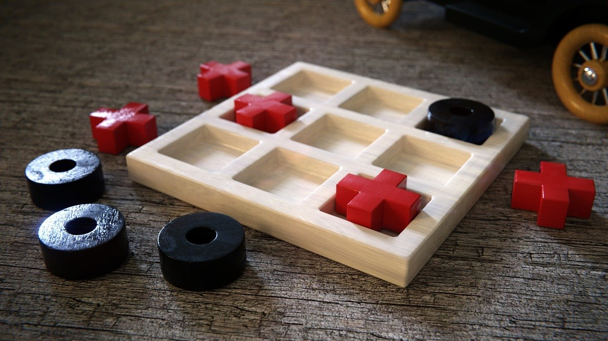
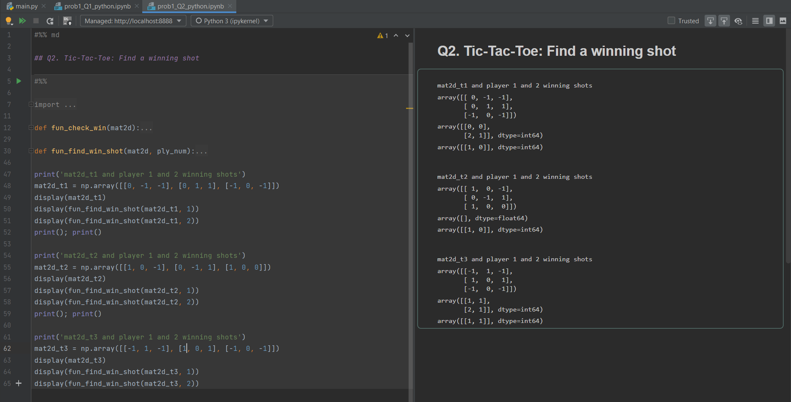

# Task01: Programming Practice & Digital Image Processing Basic

**Announcement**: January 05, 2021  
**1st Due Date**: January 14, 2021 before 11:59 pm  
**2nd Due Date**: January 21, 2021 before 11:59 pm  

**Problem Description**  

## Problem 1
The main goal of this problem is to prepare for your programming activities throughout the course. It is a good opportunity for reviewing the programming course materials that you learned in your undergraduate. You can review your own course material or the instructor's teaching material from [AE/ENVE/GEOE121](https://github.com/chulminy/AE_ENVE_GEOE_121#course-outline). Note that you will get zero if you just copy and paste existing solutions in Google.  

We will going to design a Tic-tac-toe game! 




### Q1. Tic-Tac-Toe: Find a winner

Tic-tac-toe is a paper-and-pencil game for two players, X and O, who take turns marking the spaces in a 3×3 grid. The player who succeeds in placing three of their marks in a diagonal, horizontal, or vertical row is the winner. 

Create a function `fun_check_win` that has one input and one output to evaluate who wins this game. 

```matlab
function winner = fun_check_win(mat2d)
```

```python
def fun_check_win(mat2d):

return winner
```

The input 'mat2d' is a 3 x 3 matrix, which contain 1, -1 and 0. -1 and 1 indicate X and O respectively and 0 represents that the space hasn't been filled yet. Player 1 and 2 use X and O marks, respectively. The output 'winner' include a winner's id. If Player 1 wins the game, assign 1 to 'winner'. If Player 2 does, 2 is assigned to 'winner'. If the winner cannot be determined yet from 'mat2d', assign 0 to 'winner'. 

You need to show that your `fun_check_win` produces correct outcomes (e.g., screen capture), like the below. You should not hide your code! 

|MATLAB|
|---|
||

|Python|
|---|
||


### Q2. Tic-Tac-Toe: Find a winning shot

This question is to make a function to find winning shot location(s) of a given player. The input 'mat2d' is the same as the previous question. Create a function `fun_find_win_shot` that has two input and one output to evaluate winning shot locations when an input grid and player number is given. 

```matlab
function win_loc = fun_find_win_shot(mat2d, ply_num)
```
The output 'win_loc' is a linear index (for MATLAB) or subscript index (for Python) of the winning shot location in 'mat2d'. If the multiple locations are valid, 'win_loc' becomes a row vector (for MATLAB) or a matrix (for Python) and it values should be in order. 'ply_num' is a player number, which is either 1 or 2.  If there is no winning shot, 'win_loc' becomes an empty vector. 

You need to show that your `fun_find_win_shot` produces correct outcomes (e.g., screen capture), like the below. You should not hide your code! 

|MATLAB|
|---|
||

|Python|
|---|
||


### Q3. Tic-Tac-Toe: Beating a random bot 

You are going to make your Tic-Tac-Toe bot and beating a random bot `fun_rand_ttt_bot`. You are a **Player 1**. Create a function `fun_my_ttt_bot` that has one input 'mat2d' and one output: 

```matlab
loc = fun_my_ttt_bot(mat2d)
```

You can pass this question if your chance of winning is more than 70%. Provide your code and results (e.g., screen shots or screen videos)

Please use the following template code and design your `fun_my_ttt_bot`:
* MATLAB: `task1_prob1.m` (see from this [folder](matlab))
* Python: `main.py` (see from this [folder](python))

### Q4. Tic-Tac-Toe: Beating a CY bot**
You are going to use the same function `fun_my_ttt_bot` but you are going to fight with Chul Min's Tic-Tac-Toe bot `fun_cy_ttt_bot`. Again, you are a Player 1. Provide your best winning rate when you compete with `fun_cy_ttt_bot`. Provide your code and results (e.g., scree nshots or screen videos). 

Please use the following template code and design your `fun_my_ttt_bot`:
* MATLAB: `task1_prob1.m` (see from this [folder](matlab))
* Python: `main.py` (see from this [folder](python))

**Warning**: For Python users!, please do not open `do_not_open_it.py` (see from this [folder](python)), which is my answer. It will distract you and will hinder you to come up with your own solution. 

|MATLAB|
|---|
||

|Python|
|---|
||


## Problem 2
The main goal of this problem is to review a tutorial for [**Digital Image Processing**](../../tutorial/image_proc). Copy this folder in your computer and run `digital_image_processing.mlx` in MATLAB (Note: If you do not find the sample images, you can download them from [**here**](https://www.dropbox.com/s/xgznul2u1l16iaw/sample_images.zip?dl=0)). Please answer the following questions in 'digital_image_processing.mlx':
 
Q.002, Q.004, Q.005, Q.009, Q.010, Q.010, Q.013, Q.015 

Also, please solve the following three problems: Exercise 001, Exercise 002, Exercise 003. Note that you can use either Python or MATLAB. 
        
**Submission of Your Work**
* You should turn in a report to uw.task@gmail.com. When you send your email, please cc your email for future reference.  
* A subject of your email must be the format of "Task01_`Your name` _ `Degree` _ `ID`"
	* `Your name`: first five lower-case letter your **first + last** name. It should be lower case. (i.g Chul Min Yeum -> chulmi, Juan Park -> juanp)   
	* `Degree`: pick your degree among BA, ME, MA, and PH (BA=Undergraduate, ME=MEng, MA=MASc, and PH=PhD)  
	* `ID`: your school ID
	* Please do not include any other text except this subject line.    
* Your report includes styled codes for all three problems (please check the Markdown tutorial for code styling). Please see the sample report format [**here**](Task0_juanp_BA_000000). 
* The report must be written with Markdown script (GFM) and all other formats like .docx or .pptx are not permitted. 
* You should also include a report in pdf that is converted from your report in Markdown.  
* In your submission folder, you should include a report in the format of both .pdf and .md in a folder. And, it should be zipped before attaching it to your email. 
* The formats of the folder and files are 
	* Folder name: Task01_`Your name` _ `Degree` _ `ID` (same with the subject of your email)  
	* File names: "Rept_`Your name` _ `Degree` _ `ID`.md and .pdf".   
* Please review the general submission instruction in the course syllabus. 
* When you violate these submission guideline, your report may be returned. 

> For example, Juan Park is preparing for the submission. Juan need to submit his report to **uw.task@gmail.com** with an attachment of **Task01_juanp_BA_000000.zip**. In the folder, there are **at least** two files and code files: 
> * Rept_juanp_BA_000000.md
> * Rept_juanp_BA_000000.pdf

**Note**
* You are permitted to **discuss the task with your colleague**, but do not copy the solutions.  
* Your grade depends on the completeness and clarity of your work. 
* You should include clear and concise comments in your codes.