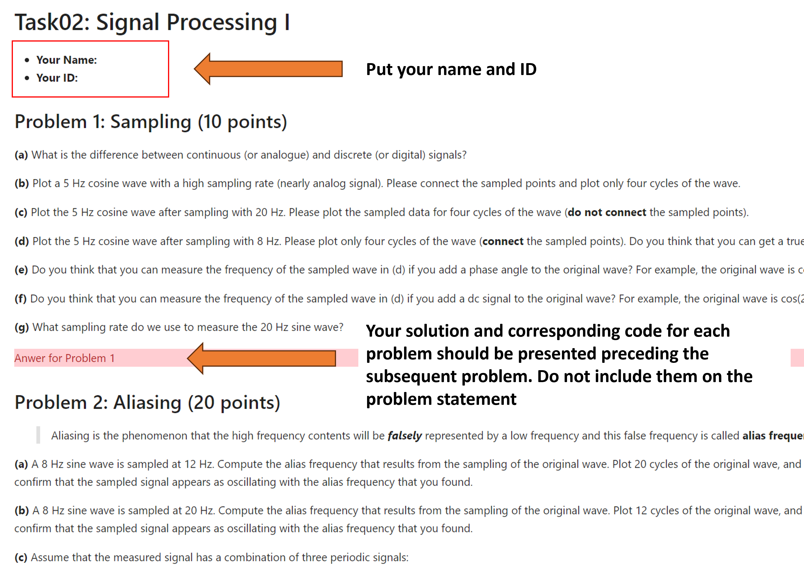

# Task02: Signal Processing I

**Announcement**: January 15, 2025        
**First Submission Deadline**: January 27, 2025 before 11:59pm  
**Second Submission Deadline**: February 03, 2025 before 11:59pm       

## Objective
The primary objective of this assignment is to grasp the essentials of data acquisition systems and signal processing techniques. It's crucial to thoroughly review all the provided tutorials to effectively tackle the associated challenges. Make sure to address each sub-question within every problem, and importantly, elaborate on your reasoning. You may also find it necessary to develop your own code in order to resolve these queries.

Jupyter notebook: [Task02_signal_processing_I_ChulminYeum.ipynb](Task02_signal_processing_I_ChulminYeum.ipynb)

Please use the following syntax for the title of your answer.

`` 
 Answer for Problem 1 
 ``

## Submission Guidelines
* Students must submit both a Jupyter notebook file and its PDF conversion.
* The primary grading will be based on the PDF file, but the notebook file may be executed if necessary.
* Ensure all results are executed and displayed in the Jupyter notebook before conversion to PDF. 
* Include your full name (first and last) at the end of the file names. For example, `Task02_signal_processing_I_NoreenGao.ipynb` and `Task02_signal_processing_I_NoreenGao.pdf`.
* Your submission should include a report in both .pdf and .ipynb formats, contained within a folder. 
* Ensure to include all necessary files within the folder that are required for the successful execution of the Jupyter notebook file.
* The folder, named `Task02_YourName_YourID`, should be zipped before emailing. For example, if your name and ID are Chulmin Yeum and 214102, the folder name becomes `Task02_ChulminYeum_214102`
* Email your work to `uw.task@gmail.com` and cc yourself. Use the subject format `Task02_YourName_YourID`.
* Review the general submission instructions in the course syllabus for further details.
* When you violate these submission guidelines, your report may be returned. 

## Notes
* Please post a question if you need to help understand the problem and/or tutorials. 
* You are permitted to discuss the task with your colleagues, but do not copy the solutions.     
* Your grade depends on the completeness and clarity of your work.  
* You should include clear and concise comments in your codes.  