# Task2: Signal Processing I

**Name:** Saeed Hatefi Ardakani
**Degree:** PH
**ID:** 20793159

## Problem 1: Sampling

##### (a) What is the difference between a continuous (or analogue) and discrete (or digital) signals?

Continuous-time signals are known as an independent variables which are continuous over time. This means that we can consider infinite set of sequence. Discrete-time signals are defined at the discrete moment of time, meaning that finite set of sequence. Therefore, by sampling the continuous signal, we can take discrete set of values.

##### (b) Plot a 6 Hz sine wave with high sampling rate (nearly analog signal). Please connect sampled points and plot only four cycles of the wave.


```matlab
f = 6; % Frequency-f (Hz)
Fsa = 1000; % # of samples per a second
N = 4; % Number of cycles
t = [0:1/Fsa:N/f]; % time (second)

y = sin(2*pi*f*t); % Amplitude

figure (1);
plot(t,y,'b-');
```

##### (c) Plot the 3 Hz sine wave after sampling with 10 Hz. Please do not connect sampled points and plot the sampled data for four cycles of the wave.

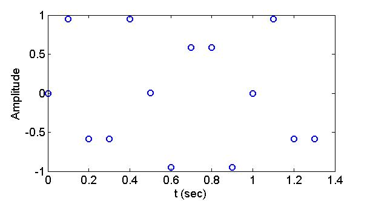

```matlab
f = 3; % Frequency-f (Hz)
Fsa = 10; % # of samples per a second
N = 4; % Number of cycles
t = [0:1/Fsa:N/f]; % time (second)

y = sin(2*pi*f*t); % Amplitude

figure (2);
plot(t,y,'ob');
```

##### (d) Plot the 6 Hz sine wave after sampling with 11 Hz. Please do not connect sampled points and plot only four cycles of the wave. Do you think that you can measure this wave?

No, we cannot measure this wave because the nyquist frequency (fs/2) is smaller than the actual frequency. So, aliasing will happen here.


```matlab
f = 6; % Frequency-f (Hz)
Fsa = 11; % # of samples per a second
N = 4; % Number of cycles
t = [0:1/Fsa:N/f]; % time (second)

y = sin(2*pi*f*t); % Amplitude

figure (3);
plot(t,y,'or');
```

##### (e) Plot the 6 Hz sine wave after sampling with 12 Hz. Please do not connect sampled points and plot only four cycles of the wave. Do you think that you can measure this wave if you add a phase angle (φ) on this sine wave? for example, the wave is sin(2πft + φ).

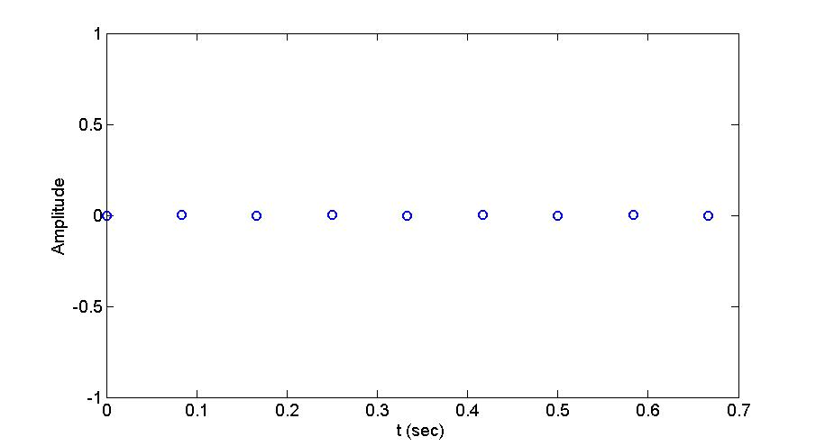

```matlab
f = 6; % Frequency-f (Hz)
Fsa = 12; % # of samples per a second
N = 4; % Number of cycles
t = [0:1/Fsa:N/f]; % time (second)

y = sin(2*pi*f*t); % Amplitude

figure (4);
plot(t,y,'or');
```
It depends on the value of phase angle (φ). If we consider phase angles φ = +nπ/2 and -nπ/2 (n is integer greater than zero n=1,...,), we can measure this wave. For other values of φ, we cannot measure this wave. In the following, the figures for φ = +π/2,-π/2 and +π/4 have been ploted. As, you can see, for φ = +π/2 and -π/2, we can measure the actual wave after smapling with 12 Hz, while for φ = +π/4, we cannot do this.


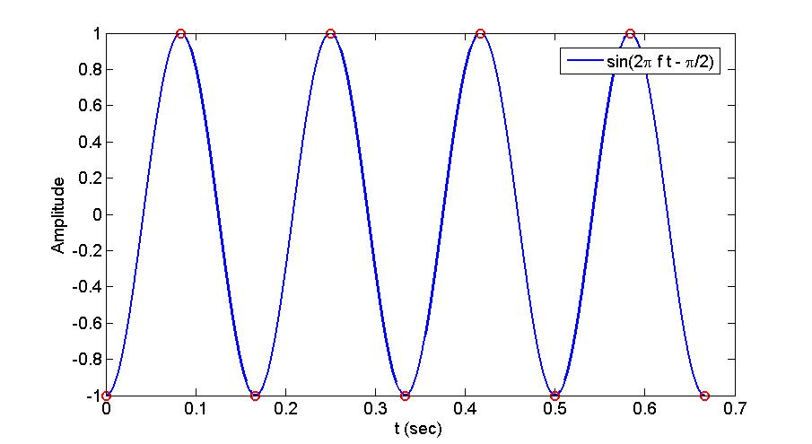


##### (f) Do you think that you can measure this wave if you add a dc signal on this sine wave? for example, the wave is sin(2πft) + d.

No, we cannot measure this wave if we add a dc signal on this sine wave. By doing this, we will only shift the wave during y direction. For example, I have plotted the figure for d = 1.


## Problem 2: Aliasing

##### (a) A 6 Hz sine wave is sampled at 8 Hz. Compute the alias frequency that can be represented in the resulting sampled signal. Plot the wave and sampled points.

According to the below figure, the alias frequency is equal to 2 Hz.

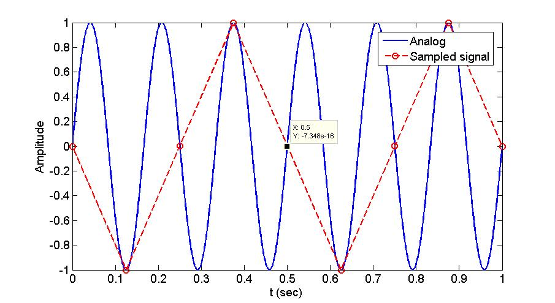

```matlab
f = 6; % Frequency-f (Hz)
Fsa = 1000; % # of samples per a second
N = 6; % Number of cycles
t = [0:1/Fsa:N/f]; % time (second)
y = sin(2*pi*f*t); % Amplitude
hold on;
plot(t,y,'b-');


Fsa = 8; % # of samples per a second
N = 6; % Number of cycles
t = [0:1/Fsa:N/f]; % time (second)
y = sin(2*pi*f*t); % Amplitude
hold on;
plot(t,y,'r--o');
```

In addition, the alias frequency equals the absolute value of the difference between the closest integer multiple of the sampling frequency and the input frequency, as shown in the following equation:

AF = |CIMSF - IF|

where AF is the alias frequency, CIMSF is the closest integer multiple of the sampling frequency, and IF is the input frequency.

AF = |8 - 6| = 2


##### (b) A 15 Hz sine wave is sampled at 15 Hz. Compute the alias frequency that can be represented in the resulting sampled signal. Plot the wave and sampled points.

According to the below figure, the alias frequency of the constant function is equal to 0 Hz.


```matlab
f = 15; % Frequency-f (Hz)
Fsa = 1000; % # of samples per a second
N = 4; % Number of cycles
t = [0:1/Fsa:N/f]; % time (second)
y = sin(2*pi*f*t); % Amplitude
figure(1);
plot(t,y,'b-');


Fsa = 15; % # of samples per a second
N = 4; % Number of cycles
t = [0:1/Fsa:N/f]; % time (second)
y = sin(2*pi*f*t); % Amplitude
hold on;
plot(t,y,'r--o');
```

In addition, the alias frequency equals the absolute value of the difference between the closest integer multiple of the sampling frequency and the input frequency, as shown in the following equation:

AF = |CIMSF - IF| = |15 - 15| = 0 Hz


##### (c) Assume that the measured signal has a combination of periodic signals:

 ##### 

 ##### If the signal is sampled at 100 Hz, determine the frequency content of the resulting discrete response signal.

 According to the below figure, the alias frequency is equal to 25 Hz.


 ```matlab
 Fsa = 10000; % # of samples per a second
 N = 4; % Number of cycles
 t = [0:1/Fsa:N/f]; % time (second)
 y = 1*sin(2*pi*25*t) + 2*sin(2*pi*75*t) + 3*sin(2*pi*125*t); % Amplitude
 figure(1);
 plot(t,y,'b-');


 Fsa = 100; % # of samples per a second
 N = 4; % Number of cycles
 t = [0:1/Fsa:N/f]; % time (second)
 y = 1*sin(2*pi*25*t) + 2*sin(2*pi*75*t) + 3*sin(2*pi*125*t); % Amplitude
 hold on;
 plot(t,y,'r--o');
 ```

 Also, the alias frequency equals the absolute value of the difference between the
 closest integer multiple of the sampling frequency and the input frequency,
  as shown in the following equation:

 Aliasing Frequency = |CIMSF - IF|


Therefore, the resulting signal will appear to only have frequencies at 25 Hz.


##### (d) Assume that the measured signal has a combination of periodic signals: If the signal is sampled at 150 Hz, determine the frequency content of the resulting discrete response signal.

According to the below figure, the alias frequency is equal to 25 Hz. Also, it should be mentioned that this frequency is related to the coeficients A1, A2 and A3. For example, if A1=A2=A3, the digitized frequency would be zero.

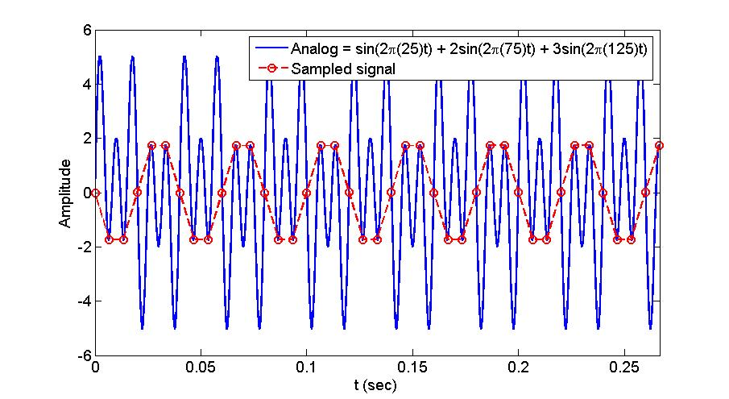

```matlab
Fsa = 10000; % # of samples per a second
N = 4; % Number of cycles
t = [0:1/Fsa:N/f]; % time (second)
y = 1*sin(2*pi*25*t) + 2*sin(2*pi*75*t) + 3*sin(2*pi*125*t); % Amplitude
figure(1);
plot(t,y,'b-');


Fsa = 150; % # of samples per a second
N = 4; % Number of cycles
t = [0:1/Fsa:N/f]; % time (second)
y = 1*sin(2*pi*25*t) + 2*sin(2*pi*75*t) + 3*sin(2*pi*125*t); % Amplitude
hold on;
plot(t,y,'r--o');
```

Also, the alias frequency equals the absolute value of the difference between the
closest integer multiple of the sampling frequency and the input frequency,
 as shown in the following equation:

Aliasing Frequency = |CIMSF - IF|


## Problem 3: Issues in Sampling


##### (a) Please explain a quantification error. When do they occur? How to avoid?

For mapping a continuous set of values (infinite number of values) to the finite number of values, quantization has been utilized. This process is done by some methods like rounding or truncation. Quantization error is an error related to convert an analog signal to a digital signal. In fact, by quantizing an analog signal, a difference, known as an error, between collected digital data and the analog signal is observed at each time. This leads to a finite number of bands, each of which is shown by its averaging value. With the size of bands at each time sampling (gap between discrete points) increases, the value of error becomes higher. For reducing the quantization errors, there are some methods:
-	Minimizing the noise measure related to signal by selecting the filter approximation
-	Using higher frequency sensors
-	Arising the number of digital bits
-	Using higher and higher memory to reduce the error


##### (b) Please explain a clipping error. When do they occur? How to avoid?

When a sensor recording signal has a threshold, a clipping error will happen. In fact, when the range of data associated with the signal exceeds the sensor threshold may have an error.
Clipping can be removed by using some devices like an oscilloscope to see the smoothness of the signal at the top and bottoms points. Also, using limiter devices the amplitude of a signal can be reduced to avoid losing the data.


##### (c) Please explain an oversampling issue. When do they occur? What are the consequence of the oversampling?

Oversampling occurs when we use a much high sampling frequency to collect data from a signal, resulting in sampling frequency much higher than the required nyquist_frequency.
One of the disadvantages of sampling frequency is that this large amount of data needs memory with high capacity. Also, computational cost for processing this amount of data is so high.

##### (d) Assume that a building vibrates with a 5 Hz sine wave:


##### and you measured this vibration using your accelerometer and DAQ system. Please write a code to create three different sampled signals that are damaged by aliasing, quantization error and clipping error, respectively. Also, generate a signal having an oversampling issue. You should understand the topics of Aliasing, Quantization, Clipping, and Oversampling in data_aquisition_W20_v4.mlx to solve this problem. You need to explain why your sampled signals contain each of these errors/issue. You can assume any sampling rate, output range, or ADC resolution to generate these signals. Your code should plot these three signals.

 **Aliasing**

 The original frequency is above the Nyquist frequency (4 Hz) and so we see that the sampled signal has a different frequency.


 ```matlab
 f = 5; % Frequency-f (Hz)
 Fsa = 1000; % # of samples per a second
 N = 6; % Number of cycles
 t = [0:1/Fsa:N/f]; % time (second)
 y = sin(2*pi*f*t); % Amplitude
 figure(1);
 plot(t,y,'b-');

 Fsa = 8; % # of samples per a second
 N = 6; % Number of cycles
 t = [0:1/Fsa:N/f]; % time (second)
 ys = sin(2*pi*f*t); % Amplitude
 hold on;
 plot(t,ys,'r--o');
 title('Aliasing')
 ```


 **Clipping**

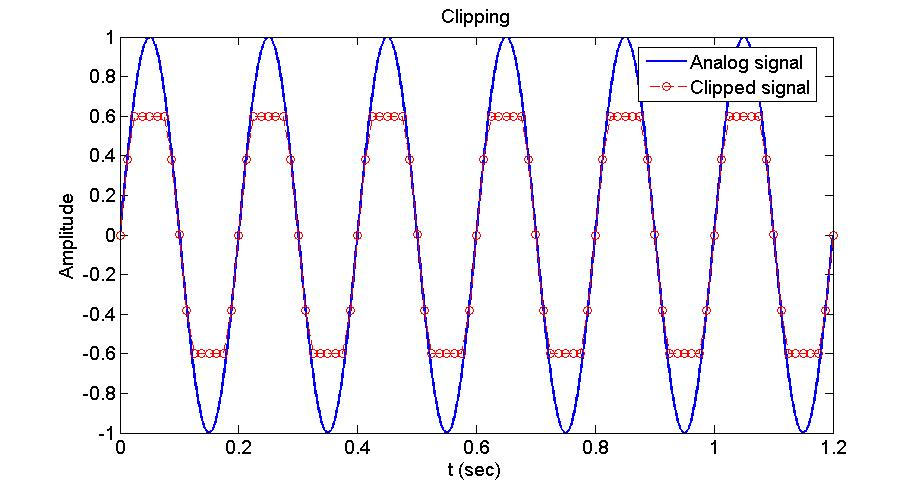

 ```matlab
 f = 5; % Frequency-f (Hz)
 Fsa = 1000; % # of samples per a second
 N = 6; % Number of cycles
 t = [0:1/Fsa:N/f]; % time (second)
 y = sin(2*pi*f*t); % Amplitude
 figure(1);
 plot(t,y,'b-');

 Fsa = 80; % # of samples per a second
 N = 6; % Number of cycles
 Threshold = 0.6; % Threshold for clipping
 t = [0:1/Fsa:N/f]; % time (second)
 ys = sin(2*pi*f*t); % Amplitude
 ys (ys>Threshold) = Threshold;
 ys (ys<-Threshold) = -Threshold;
 hold on;
 plot(t,ys,'r--o');
 title('Clipping')
 ```


 **Quantization**


 ```matlab
 f = 5; % Frequency-f (Hz)
 Fsa = 1000; % # of samples per a second
 N = 3; % Number of cycles
 t = [0:1/Fsa:N/f]; % time (second)
 y = sin(2*pi*f*t); % Amplitude
 figure(1);
 plot(t,y,'b-');

 Fsa = 1000; % # of samples per a second
 N = 3; % Number of cycles
 t = [0:1/Fsa:N/f]; % time (second)
 ys = 4*sin(2*pi*f*t); % Amplitude
 ys = round(ys)/4;
 hold on;
 plot(t,ys,'r--');
 title('Quantization')
 ```


 **Over-sampling**


 ```matlab
 f = 5; % Frequency-f (Hz)
 Fsa = 1000; % # of samples per a second
 N = 6; % Number of cycles
 t = [0:1/Fsa:N/f]; % time (second)
 y = sin(2*pi*f*t); % Amplitude
 figure(1);
 plot(t,y,'b-');

 Fsa = 1000; % # of samples per a second
 N = 6; % Number of cycles
 t = [0:1/Fsa:N/f]; % time (second)
 ys = sin(2*pi*f*t); % Amplitude
 hold on;
 plot(t,ys,'r--o');
 title('Over-sampling')
 ```

## Problem 4: Fourier Series 1

##### (a) Plot a wave1 sampled with a 50 Hz sampling rate. The wave1 is


where f0 = 15. Please connect sampled points and plot only ten cycles of the wave.

We can write y(t) as:


So, the actual frequency is equal to


```matlab
f0 = 15; % Frequency-f (Hz)
Fsa = 50; % # of samples per a second
N = 5; % Number of cycles
t = [0:1/Fsa:N/f0]; % time (second)
y = sin(2*pi*f0*t).*sin(2*pi*f0*t); % Amplitude
figure(1);
plot(t,y,'r-');

t = [0:0.00001:N/f0]; % time (second)
y = sin(2*pi*f0*t).*sin(2*pi*f0*t); % Amplitude
hold on
plot(t,y,'--');
```

##### (b) Derive a Fourier series (general form) of analytic wave1. You should find analytic equations for coefficients of a0, an, and bn.

We can write y(t) as:


A Fourier series (general form) of function y(t) can be written as:


By comparing the global form of Fourier series and , it can be concluded that


##### (c) Derive a Fourier series (complex form) of analytic wave1.You should find an analytic equations for a coefficient of cn.

Using the Euler formula, we have


Therefore, we can regenerate y(t) as:


A Fourier series (general form) of function y(t) can be written as:


By comparing the global form of Fourier series and , it can be concluded that


##### (d) Derive a Fourier series (general form) of analytic wave2:


You should find analytic equations for coefficients of a0, an, and bn.

The diffrenece between the current wave and the previous one is only shifting upwards. In other words,


Therefore,


##### (e) Please compare the results of (b) and (d) and explain their difference.

The only difference betwen the results of (b) and (d) is the valu of . This value in the result (d) is 5 units larger than the one in the result (b).  So, it can be concluded that shifting a function upwards or downwards is only determibed by the zeroth coeficient a0 in the Fourier series.


## Problem 5: Fourier Series 2

##### Sawtooth wave: https://en.wikipedia.org/wiki/Sawtooth_wave

##### (a) Plot only ten cycles of a sawtooth wave:


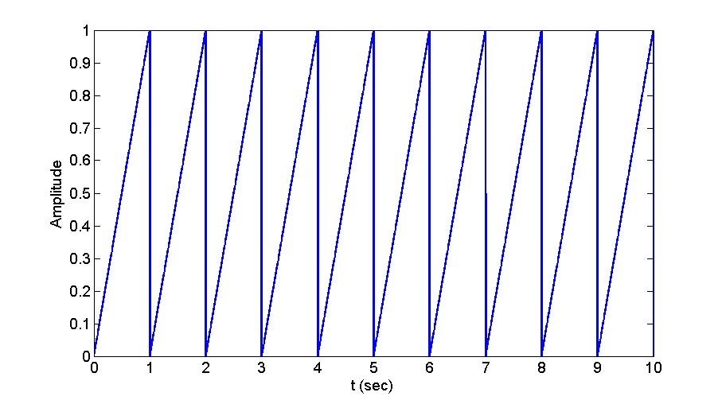

```matlab
f = 1; % Frequency-f (Hz)
Fsa = 1000; % # of samples per a second
N = 10; % Number of cycles
t = [0:1/Fsa:N/f]; % time (second)

x = t-floor(t);

figure (1);
plot(t,x,'b-');
```

##### (b) Derive a Fourier series (general form) for a sawtooth wave:


##### Please check the wikipedia link. You should find analytic equations for coefficients of a0, an, and bn.


##### (c) Derive a Fourier series (complex form) for the same sawtooth wave.You should find an analytic equation for a coefficient of cn.


##### (d) Write a code to create and plot approximated sawtooth waves (# of coeffcients (n) = 8) using the derived Fourier series in the general and complex forms. You should compare the waves from the general and complex forms.

We consider two groups of coeficients for the general and complex forms:

**Group 1:**

genral form: a0, a1, a2, ... , a8

Complex form: c0, c-1, c-2, c-3, c-4, c1, c2, c3, c4


**Group 2:**

genral form: a0, a1, a2, ... , a8

Complex form: c0, c-1, c-2, c-3, c-4, c-5, c-6, c-7, c-8, c1, c2, c3, c4, c5, c6, c7, c8


In the following, we have plotted sawtooth wave for exact function, general form, and complex form.

**Group 1:**

 As you can see, the two forms are in a good agreement with the exact result. Also, for showing the difference between two forms, an small part of the figure (square with dash) has been plotted. A little bit difference between two forms is presented.


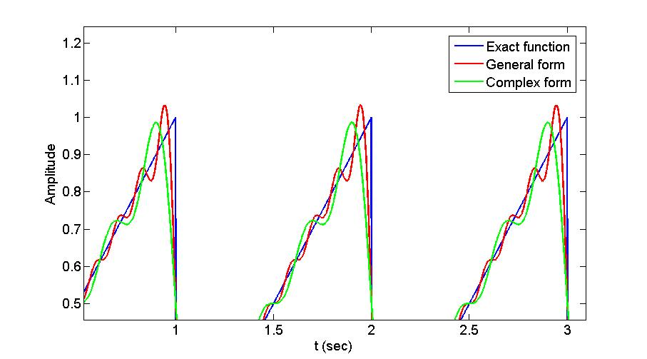

**Group 2:**

Here, we consider n=-8 to 8 coeficients for the complex form. As you can see, the results for two forms are exactly the same. It means that the complex form needs twice the number of coefficients to have the same result with the general form of series.


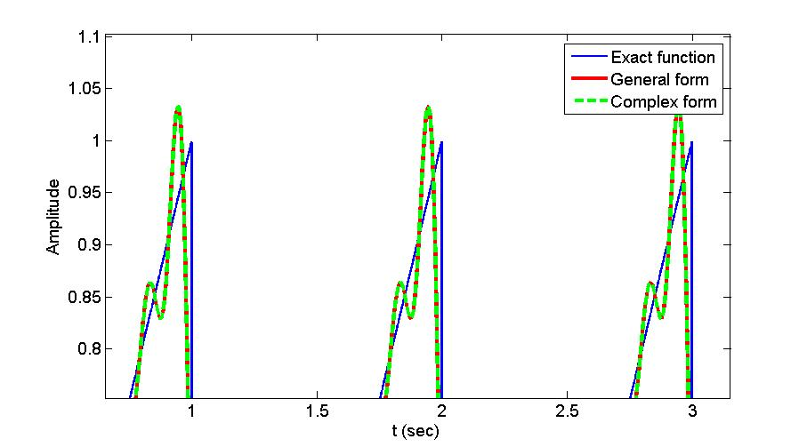

```matlab
clc
clear all

%%%%%%%%%%%%%%%%%%%%%%%%%%%%%%%%%%
% Ploting exact function
%%%%%%%%%%%%%%%%%%%%%%%%%%%%%%%%%%
f = 1; % Frequency-f (Hz)
Fsa = 1000; % # of samples per a second
N = 10; % Number of cycles
t = [0:1/Fsa:N/f]; % time (second)

x = t-floor(t);

figure(1);
plot(t,x,'b-');

%%%%%%%%%%%%%%%%%%%%%%%%%%%%%%%%%%%%%%%%%%%%%%%%%%%%%%%%%%%%%%%%%%%%%%%%%%
% Ploting approximated sawtooth waves using the derived Fourier series in
% the general form
%%%%%%%%%%%%%%%%%%%%%%%%%%%%%%%%%%%%%%%%%%%%%%%%%%%%%%%%%%%%%%%%%%%%%%%%%%
f = 1; % Frequency-f (Hz)
N = 10; % Number of cycles
t = [0:1/1000:N/f]; % time (second)
a0 = 1;
c0 = 0.5;
nCoeff = 8;

for ii=1:nCoeff
    if ii==1
        x = a0/2 + (-1/ii/pi)*sin(2*pi*ii*t);
    else
        x = x + (-1/ii/pi)*sin(2*pi*ii*t);
    end
end

hold on;
plot(t,x,'r-');

%%%%%%%%%%%%%%%%%%%%%%%%%%%%%%%%%%%%%%%%%%%%%%%%%%%%%%%%%%%%%%%%%%%%%%%%%%
% Ploting approximated sawtooth waves using the derived Fourier series in
% the complex form
%%%%%%%%%%%%%%%%%%%%%%%%%%%%%%%%%%%%%%%%%%%%%%%%%%%%%%%%%%%%%%%%%%%%%%%%%%
x = zeros(1,length(t));
for nn=round(-nCoeff/2):round(nCoeff/2)
    if nn==0
        x = x + (c0)*exp(2*pi*i*nn*t);
    else
        x = x + (i/nn/pi/2)*exp(2*pi*i*nn*t);
    end
end

hold on;
plot(t,x,'g-');
```

##### (e) Write a code to find numerical Fourier coefficients in the general and complex forms and compare them with the analytic Fourier coefficients found in (b) and (c).

As you can see, the results of numerical Fourier coefficients in the general and complex forms are the same with the results of analytical Fourier coefficients.


```matlab
%%%%%%%%%%%%%%%%%%%%%%%%%%%%%%%%%%%%%%%%%%%%%%%%%%%%%%%%%%%%%%%%%%%%%%%%%%
% Find numerical Fourier coefficients in the general form
%%%%%%%%%%%%%%%%%%%%%%%%%%%%%%%%%%%%%%%%%%%%%%%%%%%%%%%%%%%%%%%%%%%%%%%%%%
Tp = 1; % Period (sec)
N = 10; % Number of cycles
t = [0:1/1000:N*Tp]; % time (second)
x = @(t) t-floor(t);
a0 = 2*integral(x, 0, Tp);
nCoeff = 8;

% numerical calculation of coeficients an and bn
an = zeros(nCoeff,1);
bn = zeros(nCoeff,1);
for ii=1:nCoeff
    fun_a = @(t) x(t).*cos(2*pi*ii*t/Tp);
    an(ii) = (2/Tp)*integral(fun_a, 0, Tp);
    fun_b = @(t) x(t).*sin(2*pi*ii*t/Tp);
    bn(ii) = (2/Tp)*integral(fun_b, 0, Tp);
end

% numerical integration
x_numeric = zeros(1, length(t));
for ii=1:nCoeff
    if ii==1
        x_numeric = a0/2 + an(ii)*cos(2*pi*ii*t/Tp) ...
            + bn(ii)*sin(2*pi*ii*t/Tp);
    else
        x_numeric = ...
            x_numeric + an(ii)*cos(2*pi*ii*t/Tp) ...
            + bn(ii)*sin(2*pi*ii*t/Tp);
    end
end

hold on
plot(t,x_numeric,'r-');

%%%%%%%%%%%%%%%%%%%%%%%%%%%%%%%%%%%%%%%%%%%%%%%%%%%%%%%%%%%%%%%%%%%%%%%%%%
% Find numerical Fourier coefficients in the complex form
%%%%%%%%%%%%%%%%%%%%%%%%%%%%%%%%%%%%%%%%%%%%%%%%%%%%%%%%%%%%%%%%%%%%%%%%%%
nCoeff = 8;
c0 = integral(x, 0, Tp);
% Positive coeficients cn
cn_pos = zeros(round(nCoeff/2),1);
% Negative coeficients cn
cn_neg = zeros(round(nCoeff/2),1);

for nn = 1:round(nCoeff/2)
    fun_c = @(t) x(t).*exp(-2*pi*i*nn*t);
    cn_pos(nn) = (1/Tp)*integral(fun_c, 0, Tp);
end

for nn = 1:round(nCoeff/2)
    fun_c = @(t) x(t).*exp(2*pi*i*nn*t);
    cn_neg(nn) = (1/Tp)*integral(fun_c, 0, Tp);
end

% numerical integration
x_numeric = zeros(1,length(t));
for nn=round(-nCoeff/2):round(nCoeff/2)
    if nn==0
        cn = c0;
    elseif nn<0
        cn = cn_neg(abs(nn));
    else
        cn = cn_pos(abs(nn));
    end
    x_numeric = x_numeric + cn*exp(2*pi*i*nn*t);
end

hold on;
plot(t,x_numeric,'g-');
```


## Problem 6: Fourier Transformation 1

##### Compute the Fourier transformation (integral) of the following functions and show the derivation process in detail:

##### (a) cosine wave


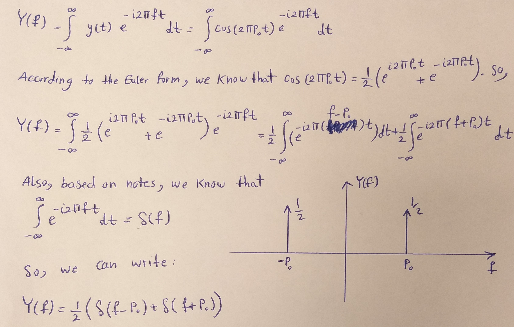

##### (b) cosine wave + dc (direct current) wave


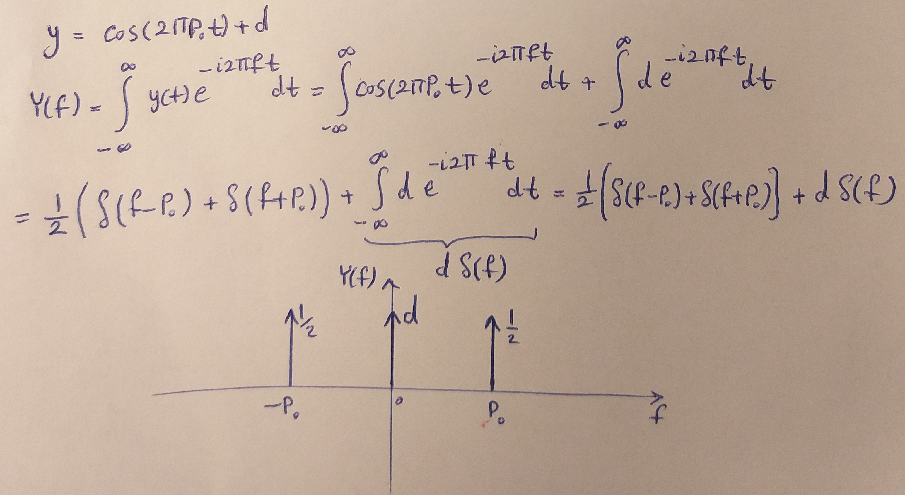

##### (c) Gaussian function


## Problem 7:Fourier Transformation 2


##### (a) Compute the Fourier transformation (integral) of the above function


![](https://latex.codecogs.com/gif.latex?Y%5Cleft%20%28%20f%20%5Cright%20%29%20%3D%20%5Cint_%7B-%5Cinfty%7D%5E%7B&plus;%5Cinfty%7Dy%28t%29e%5E%7B-i%202%20%5Cpi%20ft%7Ddt%20%3D%20%5Cint_%7B-%5Cinfty%20%7D%5E%7B&plus;%5Cinfty%20%7De%5E%7B-a%5Cleft%20%7C%20t%20%5Cright%20%7C%7D%5Cleft%20%28%5Cfrac%7Bb%7D%7B2%7D%5Cleft%20%28%20e%5E%7Bi%202%20%5Cpi%20f_%7B1%7Dt%7D%20&plus;%20e%5E%7B-i%202%20%5Cpi%20f_%7B1%7Dt%7D%5Cright%20%29&plus;%5Cfrac%7Bc%7D%7B2%7D%5Cleft%20%28%20e%5E%7Bi%202%20%5Cpi%20f_%7B2%7Dt%7D%20&plus;%20e%5E%7B-i%202%20%5Cpi%20f_%7B2%7Dt%7D%5Cright%20%29%20%5Cright%20%29e%5E%7B-i%202%20%5Cpi%20ft%7Ddt%20%3D%20%5Cint_%7B-%5Cinfty%20%7D%5E%7B&plus;%5Cinfty%20%7De%5E%7B-a%5Cleft%20%7C%20t%20%5Cright%20%7C%7D%5Cfrac%7Bb%7D%7B2%7De%5E%7Bi%202%20%5Cpi%20%5Cleft%20%28f_%7B1%7D-f%20%5Cright%20%29t%7Ddt%20&plus;%20%5Cint_%7B-%5Cinfty%20%7D%5E%7B&plus;%5Cinfty%20%7De%5E%7B-a%5Cleft%20%7C%20t%20%5Cright%20%7C%7D%5Cfrac%7Bb%7D%7B2%7De%5E%7Bi%202%20%5Cpi%20%5Cleft%20%28-f_%7B1%7D-f%20%5Cright%20%29t%7Ddt%20&plus;%20%5Cint_%7B-%5Cinfty%20%7D%5E%7B&plus;%5Cinfty%20%7De%5E%7B-a%5Cleft%20%7C%20t%20%5Cright%20%7C%7D%5Cfrac%7Bc%7D%7B2%7De%5E%7Bi%202%20%5Cpi%20%5Cleft%20%28f_%7B2%7D-f%20%5Cright%20%29t%7Ddt%20&plus;%20%5Cint_%7B-%5Cinfty%20%7D%5E%7B&plus;%5Cinfty%20%7De%5E%7B-a%5Cleft%20%7C%20t%20%5Cright%20%7C%7D%5Cfrac%7Bc%7D%7B2%7De%5E%7Bi%202%20%5Cpi%20%5Cleft%20%28-f_%7B2%7D-f%20%5Cright%20%29t%7Ddt)

We can prove that (see appendix at the end of the problem):


Therefore, according to the above equation, it can be concluded that


**Appendix (proof of the equation 
):**

![](https://latex.codecogs.com/gif.latex?%5Cint_%7B-%5Cinfty%20%7D%5E%7B&plus;%5Cinfty%20%7De%5E%7B-a%5Cleft%20%7C%20t%20%5Cright%20%7C%7De%5E%7B-i%202%20%5Cpi%20ft%7Ddt%20%3D%20%5Cint_%7B-%5Cinfty%20%7D%5E%7B0%20%7De%5E%7Bat%7De%5E%7B-i%202%20%5Cpi%20ft%7Ddt%20&plus;%20%5Cint_%7B0%7D%5E%7B&plus;%5Cinfty%7De%5E%7B-at%7De%5E%7B-i%202%20%5Cpi%20ft%7Ddt%20%3D%20%5Cint_%7B-%5Cinfty%20%7D%5E%7B0%20%7De%5E%7Bt%5Cleft%20%28%20a-i%202%20%5Cpi%20f%20%5Cright%20%29%20%7Ddt%20&plus;%20%5Cint_%7B0%20%7D%5E%7B&plus;%5Cinfty%20%7De%5E%7Bt%5Cleft%20%28%20-a-i%202%20%5Cpi%20f%20%5Cright%20%29%20%7Ddt%20%3D%20%5Cleft%20%28%20%5Cfrac%7B1%7D%7Ba-i%202%20%5Cpi%20f%7D%20-0%20%5Cright%20%29%20&plus;%20%5Cleft%20%280-%20%5Cfrac%7B1%7D%7B-a-i%202%20%5Cpi%20f%7D%20%5Cright%20%29%20%3D%20%5Cfrac%7B1%7D%7Ba-i%202%20%5Cpi%20f%7D%20&plus;%20%5Cfrac%7B1%7D%7Ba&plus;i%202%20%5Cpi%20f%7D%20%3D%20%5Cfrac%7B%28a&plus;i%202%20%5Cpi%20f%29&plus;%28a-i%202%20%5Cpi%20f%29%7D%7B%28a-i%202%20%5Cpi%20f%29%28a&plus;i%202%20%5Cpi%20f%29%7D%20%3D%20%5Cfrac%7B2a%7D%7Ba%5E%7B2%7D%20&plus;%204%20%5Cpi%20%5E2%20f%5E2%7D)

##### (b) Plot y in time domain and frequency domain, where a = 1, b = 2, c= 6, f1 = 3, and f2 = 6

The below figure shows the variations of y(t) in time domain.


The below figure shows the variations of Y(f) in frequency domain.


In order to plot y(t) and Y(f) in time domain and frequency domain, we wrote a matlab code:

```matlab
clc
clear all

%%%%%%%%%%%%%%%%%%%%%%%%%%%%%%%%%%%%%%%%%%%%%%%%%%%%%%%%
% plot y(t) and Y(f) in time domain and frequency domain
%%%%%%%%%%%%%%%%%%%%%%%%%%%%%%%%%%%%%%%%%%%%%%%%%%%%%%%%
a = 1;
b = 2;
c = 6;
f1 = 3;
f2 = 6;

t = [-3:0.001:3];
f = [-3:0.001:3];

y_t = exp(-a.*abs(t)).*(b*cos(2*pi*f1*t) + c*cos(2*pi*f2*t));

Y_f = (b/2)*(2*a)./(a^2+4*pi^2*(f-f1).^2) + (b/2)*(2*a)./(a^2+4*pi^2*(f+f1).^2) ...
    + (c/2)*(2*a)./(a^2+4*pi^2*(f-f2).^2) + (c/2)*(2*a)./(a^2+4*pi^2*(f+f2).^2);

figure(1)
plot(t,y_t,'b-');
xlabel('t');
ylabel('Amplitude');
title('Time Domain');

figure(2)
plot(f,Y_f,'r-');
xlabel('f');
ylabel('Amplitude');
title('Frequency Domain');
```

##### (c) Plot y in time domain and frequency domain, where a = 0.5, b = 2, c= 6, f1 = 3, and f2 = 6

Here, we have used the previous code to plot y(t) and Y(f).

The below figure shows the variations of y(t) in time domain.


The below figure shows the variations of Y(f) in frequency domain.

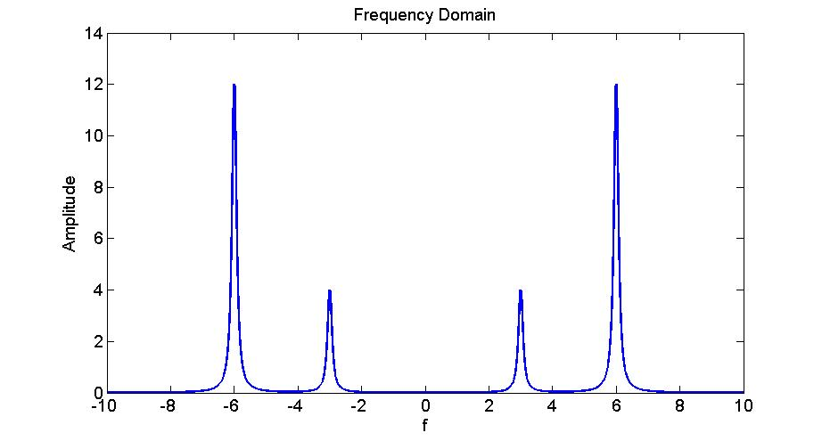

```matlab
clc
clear all

%%%%%%%%%%%%%%%%%%%%%%%%%%%%%%%%%%%%%%%%%%%%%%%%%%%%%%%%
% plot y(t) and Y(f) in time domain and frequency domain
%%%%%%%%%%%%%%%%%%%%%%%%%%%%%%%%%%%%%%%%%%%%%%%%%%%%%%%%
a = 0.5;
b = 2;
c = 6;
f1 = 3;
f2 = 6;

t = [-7:0.001:7];
f = [-10:0.001:10];

y_t = exp(-a.*abs(t)).*(b*cos(2*pi*f1*t) + c*cos(2*pi*f2*t));

Y_f = (b/2)*(2*a)./(a^2+4*pi^2*(f-f1).^2) + (b/2)*(2*a)./(a^2+4*pi^2*(f+f1).^2) ...
    + (c/2)*(2*a)./(a^2+4*pi^2*(f-f2).^2) + (c/2)*(2*a)./(a^2+4*pi^2*(f+f2).^2);

figure(1)
plot(t,y_t,'b-');
xlabel('t');
ylabel('Amplitude');
title('Time Domain');

figure(2)
plot(f,Y_f,'r-');
xlabel('f');
ylabel('Amplitude');
title('Frequency Domain');
```
