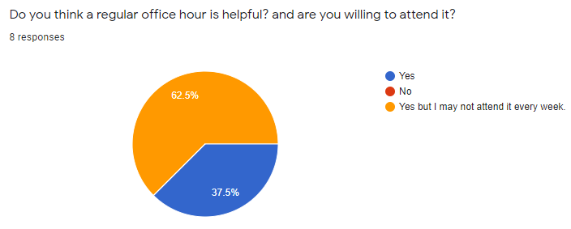

# CIVE 497/700: Survey for Office Hours

## Office Hours
Eight students responded to the survey and four students left feedback. All students agreed to schedule a regular office hour. 

||
|:--:|
||

I prefer 3:00~4:00pm on Wednesday starting from this week (2nd week of February, 2021). However, for those who are not able to attend the office hours due to schedule conflict, I can schedule an individual call so please let me know if you can't make it.  

## Students' Feedback 
**Here is my response to each written feedback**  
*Again, if you feel hard and need help, just send me a message through MS team. Any question will be fine.*

|Feedback & Answer|
|:---|
|**Student 1:** Very difficult, takes a lot of time to go through lectures and task assignments. Definitely the hardest course I'm taking this term. Would be helpful to relate course content to applications before diving into topics so we can get a feel for why/how its applicable and what were ultimately trying to do. Tasks are also fairly long in length and lectures are kind of dry.|
|**CM:** Relax... Yes, this is not an easy course and you might take more time to study and do assignments. I would say when you start to study image processing topics, you will see how to utilize the concept that you learned from signal processing lectures. For example, you now know what's Fourier transformation, right? The signal in a frequency domain is a very useful tool (form) to understand the contents of the signal. You will see the values. I'm considering giving you more time to study lectures and complete assignments. Lastly, image processing topics are more fun than signal processing ones (not dry). Unfortunately, you can't understand the fundamental of image processing unless you know the frequency domain analysis. That's why this challenging topic is placed at the beginning of this course.   
|The lectures are very well recorded and every concept is explained in great detail. The tasks are challenging and time consuming at times but the tutorials are very relevant and useful to solve the assignments.|
|**CM:** Thank you!|
|Task assignments feel longer than they need to be. Lots of repetition for some problems that don't add much value in terms of learning. For example, import image and rotate it 3 different times, then import another image and mirror it. Also, converting to markdown is very annoying, would appreciate a different way of doing this. Lastly, the tasks should tell you what lectures to watch. I didn't know for task 2 that I had to watch 4 lectures to do it until I got stuck at the end.|
|**CM:** Many students are not familiar with processing "images" using a programming language. Thus, I thought that, as the first assignment and tutorial, such repetitions are necessary and they are also part of learning. However, in following task assignments, there will not be many repetitive contents. Next, over the last ten years, sharing research works or knowledge through Github has been a major research trend and acclaimed by people in the same research communities (although it is not popular in the civil engineering). Markdown is the syntax used in Github and you should know Markdown to write a post in in Github. Completing your task in Markdown is not because I'm familiar with this syntax. I hope that you know how to use it and become experienced. Regarding "Lastly, the tasks should tell you what lectures to watch. I didn't know for task 2 that I had to watch 4 lectures to do it until I got stuck at the end.", yes, that is my fault. For the following assignment, you can follow the schedule outlined in here: https://github.com/chulminy/CIVE497-CIVE700#course-outline|
|I really appreciate the fact that Professor Yeum covered a great deal of useful content in this course, especially as a civil student, it is really cool to learn some knowledge outside of very traditional civil field. So far, I personally found that the assignments are covering almost all of the content from the lectures, so I do sometimes find that the assignments are taking me much more time in comparison to my other courses, which is expected, but this is my last term and my only opportunity to take this course, so if Professor Yeum could lighten it up a bit by reducing some questions on repetitive content it would be really helpful. I am overloading this term and time is limited, so it would really be appreciated if I am allowed to spend more time on digesting the lecture material instead of only focusing on completing assignments for this course. Thanks for taking your time to collect our feedback.|
|**CM:** Thank you. In the following tasks, there are not many repetitive contents. Since students are very new to signal processing topics, I made some repetitive questions in the assignments. I'm considering reducing the scope of the topics in this course to give the students more time to study the topics that they are currently working on. I will send out another survey for schedule adjustment.|
